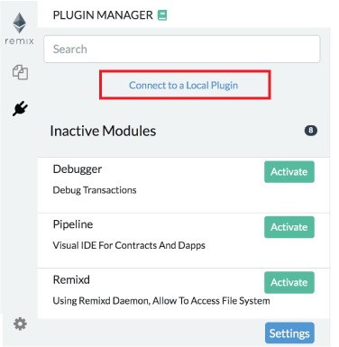

Plugin Manager
===================

## Everything is a PLUGIN in Remix

In order to integrate new tools made by us and by ...you into Remix, we've now made everything a plugin.
This architecture will also allow Remix or just parts of Remix to be integrated into other projects (your's for example).   

This means that you only load the functionality you need.  

It also means that you can turn off and on plugins - as your needs change.  

This all happens in the plug manager.  

The Plugin Manager is also the place you go when you are creating your own plugin and you want to load your local plugin into Remix. 

To load your local plugin, you'd click on the "Connect to a Local Plugin" link at the top of the Plugin Manager panel.

## TronIDE v2.3.3 connection policy

TronIDE 2.3.3 supports **local plugins only**. A custom plugin URL must use a
loopback host: `localhost`, `127.0.0.1`, or `::1`.

- iframe plugins use `http(s)://` and WebSocket plugins use `ws(s)://`;
- when TronIDE is opened over HTTPS, use a secure local endpoint where the
  browser requires it;
- remote HTTP, HTTPS, WS, and WSS plugin URLs are rejected; the old remote
  plugin directory/URL entries are not active in this release;
- connect through **Plugin Manager → Connect to a Local Plugin**, then review
  the requested plugin methods before activating it.

Only connect plugins you trust. A local plugin can interact with the
workspace through the methods listed in its profile.

To learn more about how to create your own plugin, go to
[the README of remix-plugin repo](https://github.com/ethereum/remix-plugin).
