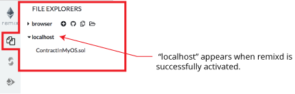

Remixd: Access your Local Filesystem 
=========================================

`remixd` is an npm module. Its purpose is to give the remix web
application access to a folder on your local computer.

The code of `remixd` is
[here](https://github.com/ethereum/remixd) .

`remixd` can be globally installed using the following command:
`npm install -g remixd`

Or just install it in the directory of your choice by removing the -g flag:
`npm install remixd`

Then from the terminal, the command `remixd -s <absolute-path-to-the-shared-folder> --remix-ide <your-remix-ide-URL-instance>` will start `remixd` and will share the given folder with remix-ide. 

For example, to use remixd with Remix IDE ( and not the alpha version) use this command: 
`remixd -s <absolute-path-to-the-shared-folder> --remix-ide https://remix.ethereum.org`

Make sure that if you use https://remix.ethereum.org (secure http) in the remixd command (like in the example above), that you are also pointing your browser to https://remix.ethereum.org and not to http://remix.ethereum.org (plain old insecure http).  Or if you want to use http in the browser use http in the remixd command.


The folder is shared using a websocket connection between `TronIDE`
and `remixd`. In TronIDE 2.3.3 the connection is made to the loopback
endpoint `ws://127.0.0.1:65520`; the remixd daemon binds to loopback and
checks the configured IDE origin.

Be sure the user executing `remixd` has read/write permission on the
folder.

There is an option to run remixd in read-only mode, use `--read-only` flag.

**Warning!**

`remixd` provides `full read and write access` to the given folder. Treat the
shared folder and the local port as a trusted local security boundary: other
applications running on your computer may be able to access the loopback
service. Share only the intended folder and use `--read-only` whenever write
access is not required.

Before opening the websocket, TronIDE obtains a 128-bit session token from the
local remixd daemon's `/remixd-token` endpoint and includes it in the local
connection URL. The daemon validates the token and the configured IDE origin
before accepting the websocket. If the token endpoint, origin check, or
handshake fails, TronIDE fails closed and does not open the filesystem session.

From `Remix IDE`, in the Plugin Manager you need to activate the remixd plugin.  

A modal dialog will ask confirmation

Accepting this dialog will start a session.

If you do not have `remixd` running in the background - another modal will open up and it will say: 

```
Cannot connect to the remixd daemon. 
Please make sure you have the remixd running in the background.
```

Assuming you don't get the 2nd modal, your connection to the remixd daemon is successful. The shared folder will be available in the file explorer.

**When you click the activation of remixd is successful - there will NOT be an icon that loads in the icon panel.**

Click the File Explorers icon and in the swap panel you should now see the folder for `localhost`.

Click on the `localhost connection` icon:


